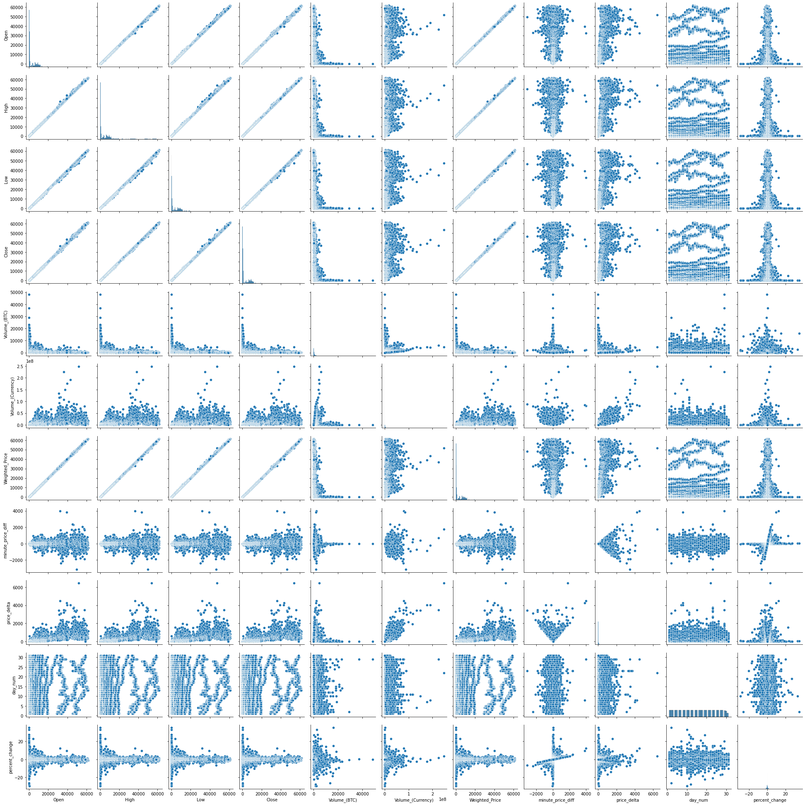

<h1>Bitcoin Price Prediction Time-Series Project</h1>

# Table of Contents 
1. [Project Planning](#project_planning)
    1. [Project Objectives](#project_objectives)
    2. [Business Goals](#business_goals)
    3. [Audience](#audience)
    4. [Deliverables](#deliverables)
2. [Executive Summary](#exe_sum)
3. [Acquire Data](#acquire)
    1. [Data Dictonary](#data_dict)
    2. [Data Description](#data_desc)
    3. [Acquire Takeaways](#acquire_takeaways)
4. [Prepare Data](#prep_data)
    1. [Distributions](#distributions)
    2. [Prepare Takeaways](#prepare_takeaways)
5. [Data Exploration](#explore)
    1. [Correlations](#correlations)
    2. [Pairplot](#pairplot)
    3. [Explore Takeaways](#explore_takeaways)
6. [Hypothesis](#hypothesis)
    1. [Conclusion](#hyp_conclusion)
7. [Modeling & Evaluation](#modeling)
    7. [Conclusions & Next Steps](#conclusions)

## Project Planning
✓ 🟢 **Plan** ➜ ☐ _Acquire_ ➜ ☐ _Prepare_ ➜ ☐ _Explore_ ➜ ☐ _Model_ ➜ ☐ _Deliver_

### Project Objectives 
> - For this project we will be working with historical price and volume data from Bitcoin between 01-01-2012 & 03-31-2021, these are Bitstamp prices and all are annotated in USD.
> - The primary focus is to see if Bitcoin price can be predicted with any reliability or if there is any cyclical observations within Bitcoin pricing or volume.
> - The csv data can be downloaded from Kaggle <a href='https://www.kaggle.com/mczielinski/bitcoin-historical-data' title='Bitstamp USD csv file download'>here</a>.

### Business Goals 
> - Create models that are better at predicting Bitcoin price than the baseline.
> - Put these models into a Juypter notebook and make the project recreatable.

### Audience 
> - Your audience for this project is a data science team. 

### Deliverables
> - A clearly named final notebook. This notebook will be what you present and should contain plenty of markdown documentation and cleaned up code.
> - A README that explains what the project is, how to reproduce you work, and your notes from project planning.
> - A Python module or modules that automate the data acquisistion and preparation process. These modules should be imported and used in your final notebook.

<a href='#toc'>Table of Contents</a>

## Executive Summary

### Goals
> - Utilize at least 3 clustering associations and 4 models to discover potential drivers of the `logerror` of the Zillow Zestimate for single-unit properties sold during 2017. 
> - Abstract the functions to sub python scripts to have a clean presentation.
> - Ensure the project is easily reproducable 

### Findings
> - All (4) hypotheses rejected the Null Hypotheses

<a href='#toc'>Table of Contents</a>

## Acquire Data
✓ _Plan_ ➜ 🟢 **Acquire** ➜ ☐ _Prepare_ ➜ ☐ _Explore_ ➜ ☐ _Model_ ➜ ☐ _Deliver_ 

### Data Tail 
(as the head has too many nulls currently)

| Timestamp           |    Open |    High |     Low |   Close |   Volume_(BTC) |   Volume_(Currency) |   Weighted_Price |
|:--------------------|--------:|--------:|--------:|--------:|---------------:|--------------------:|-----------------:|
| 2021-03-30 23:56:00 | 58714.3 | 58714.3 | 58686   | 58686   |       1.38449  |             81259.4 |          58692.8 |
| 2021-03-30 23:57:00 | 58684   | 58693.4 | 58684   | 58685.8 |       7.29485  |            428158   |          58693.2 |
| 2021-03-30 23:58:00 | 58693.4 | 58723.8 | 58693.4 | 58723.8 |       1.70568  |            100117   |          58696.2 |
| 2021-03-30 23:59:00 | 58742.2 | 58770.4 | 58742.2 | 58760.6 |       0.720415 |             42333   |          58761.9 |
| 2021-03-31 00:00:00 | 58767.8 | 58778.2 | 58756   | 58778.2 |       2.71283  |            159418   |          58764.3 |

### Data Dictonary 

| Feature           | Datatype                         | Definition                                                 |
|:------------------|:---------------------------------|:-----------------------------------------------------------|
| Timestamp         | 4857377 non-null: datetime64[ns] | start tiem of time window (60s window), in Unix Time       |
| Open              | 3613769 non-null: float64        | Open price at start time window                            |
| High              | 3613769 non-null: float64        | High price within the time window                          |
| Low               | 3613769 non-null: float64        | Low price within the time window                           |
| Close             | 3613769 non-null: float64        | Close price at the end of the time window                  |
| Volume_(BTC)      | 3613769 non-null: float64        | Volume of BTC transacted in this window                    |
| Volume_(Currency) | 3613769 non-null: float64        | Volume of corresponding currency transacted in this window |
| Weighted_Price    | 3613769 non-null: float64        | VWAP - Volume Weighted Average Price 

### Takeaways from Acquire:

> - Target variable: `Close`
> - This dataframe currenly has 4,857,377 rows and 8 columns
> - There are 1,243,608 missing values.
> - All columns are float64 types of data.

<a href='#toc'>Table of Contents</a>

## Prepare Data
✓ _Plan_ ➜ ✓ _Acquire_ ➜ 🟢 **Prepare** ➜ ☐ _Explore_ ➜ ☐ _Model_ ➜ ☐ _Deliver_
> - Add additional columns of `month`, `day_of_week`, `minute_price_diff`, `intraday_high_low`, `percent_change` and `day_num`.
> - Filling the null values with the most recent value will likely be the best course of action.

### New Data Dictionary

| Feature           | Datatype                  | Definition                                                 |
|:------------------|:--------------------------|:-----------------------------------------------------------|
| Open              | 4857377 non-null: float64 | Open price at start time window                            |
| High              | 4857377 non-null: float64 | High price within the time window                          |
| Low               | 4857377 non-null: float64 | Low price within the time window                           |
| Close             | 4857377 non-null: float64 | Close price at the end of the time window                  |
| Volume_(BTC)      | 4857377 non-null: float64 | Volume of BTC transacted in this window                    |
| Volume_(Currency) | 4857377 non-null: float64 | Volume of corresponding currency transacted in this window |
| Weighted_Price    | 4857377 non-null: float64 | VWAP - Volume Weighted Average Price                       |
| day_of_week       | 4857377 non-null: object  | Verbose name of the week                                   |
| month             | 4857377 non-null: object  | Month number and month name                                |
| minute_price_diff | 4857377 non-null: float64 | Delta between the Close and Open                           |
| price_delta       | 4857377 non-null: float64 | Delta between the High and Low                             |
| day_num           | 4857377 non-null: int64   | The numeric number of the day of the month                 |
| percent_change    | 4857377 non-null: float64 | Price difference / Open price represented as a percentage  |

### Prepare Takeaways
> - The data is now prepared to be input into the explore aspects of the data pipeline to evaluate what features we should use to potentially run time-series analysis on.
                     

<a href='#toc'>Table of Contents</a>

## Explore Data
✓ _Plan_ ➜ ✓ _Acquire_ ➜ ✓ _Prepare_ ➜ 🟢 **Explore** ➜ ☐ _Model_ ➜ ☐ _Deliver_

### Correlations

#### Correlations of Logerror
|  Column Name |     logerror |
|:-----------------------------|-------------:|
| bathroomcnt                  |  0.00474117  |
| id                           |  0.00447373  |
| regionidcounty               |  0.00292009  |
| rawcensustractandblock       |  0.00269419  |
| fips                         |  0.00269152  |
| roomcnt                      |  0.00199583  |
| latitude                     |  0.00182852  |
| bedroomcnt                   |  0.00125381  |
| calculatedfinishedsquarefeet | -0.000362524 |
| regionidzip                  | -0.000494803 |
| propertylandusetypeid        | -0.00150166  |
| lotsizesquarefeet            | -0.00249514  |
| assessmentyear               | -0.00295415  |
| longitude                    | -0.00302902  |
| landtaxvaluedollarcnt        | -0.00305275  |
| regionidcity                 | -0.00402482  |
| taxamount                    | -0.0042753   |
| taxvaluedollarcnt            | -0.00445937  |
| structuretaxvaluedollarcnt   | -0.00542311  |
| yearbuilt                    | -0.00712105  |

### Pair Plot

### Explore Takeaways
> - It is apparent that the most correlated features with the `logerror` are `yearbuilt`, `structuretaxvaluedollarcnt`, `bathroomcnt`. 
> - The best features from the feature engineering aspect were `bathroomcnt`, `yearbuilt` & `assessmentyear`.

<a href='#toc'>Table of Contents</a>

### Hypothesis 1 Correlation Test `logerror` vs `id`
> - ${H}_{0}$: There is no correlation between `logerror` and `id`
> - ${H}_{a}$: There is a correlation between `logerror` and `id`

__r-value__: 0.00177

__p-value__: 0.76129

We fail to reject null hypothesis. There is no relationship between `logerror` and `id`

### Hypothesis 2 Correlation Test `logerror` vs `bathroomcnt`
> - ${H}_{0}$: There is no correlation between `logerror` and `bathroomcnt`
> - ${H}_{a}$: There is a correlation between `logerror` and `bathroomcnt`

__r-value__: 0.00354

__p-value__: 0.54214

We fail to reject null hypothesis. There is no relationship between `logerror` and `bathroomcnt`

### Hypothesis 3 Correlation Test `logerror` vs `bedroomcnt`
> - ${H}_{0}$: There is no correlation between `logerror` and `bedroomcnt`
> - ${H}_{a}$: There is a correlation between `logerror` and `bedroomcnt`

__r-value__: 0.00261

__p-value__: 0.65306

We fail to reject null hypothesis. There is no relationship between `logerror` and `bedroomcnt`

### Hypothesis 4 Correlation Test `logerror` vs `calculatedfinishedsquarefeet`
> - ${H}_{0}$: There is no correlation between `logerror` and `calculatedfinishedsquarefeet`
> - ${H}_{a}$: There is a correlation between `logerror` and `calculatedfinishedsquarefeet`

__r-value__: 0.00126

__p-value__: 0.82831

We fail to reject null hypothesis. There is no relationship between `logerror` and `calculatedfinishedsquarefeet`

## Modeling & Evaluation
✓ _Plan_ ➜ ✓ _Acquire_ ➜ ✓ _Prepare_ ➜ ✓ _Explore_ ➜ 🟢 **Model** ➜ ☐ _Deliver_

### Cluster 1

### Cluster 2

### Cluster 3

## Project Delivery
✓ _Plan_ ➜ ✓ _Acquire_ ➜ ✓ _Prepare_ ➜ ✓ _Explore_ ➜ ✓ _Model_ ➜ 🟢 **Deliver**

## Conclusions & Next Steps

> - I found that most of the models weren't to different in their accuracy, even with hyperparameter optimization and feature engineering.
> - If I had more time to work on this project, I'd continue doing more feature engineering and hyperparameter optmization. 

<a href='#toc'>Table of Contents</a>

