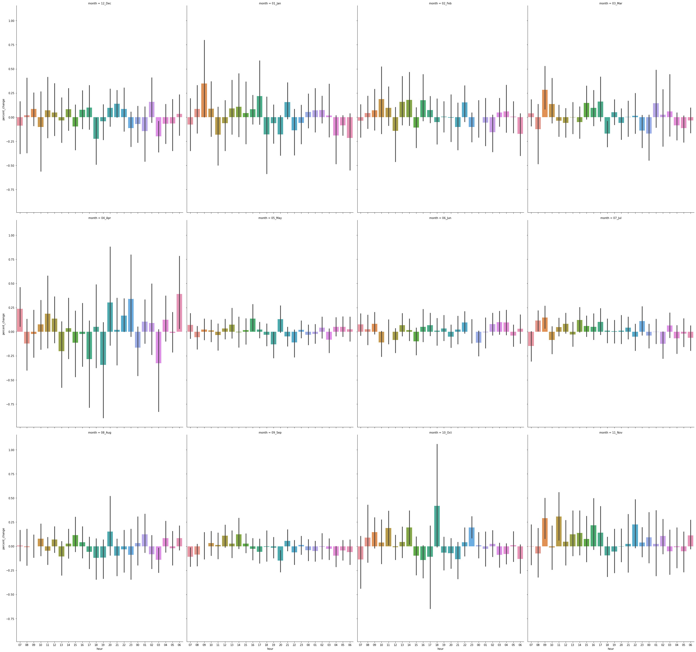

<h1>Bitcoin Price Prediction Time-Series Project</h1>

# Table of Contents 
1. [Project Planning](#project_planning)
    1. [Project Objectives](#project_objectives)
    2. [Business Goals](#business_goals)
    3. [Audience](#audience)
    4. [Deliverables](#deliverables)
2. [Executive Summary](#exe_sum)
3. [Acquire Data](#acquire)
    1. [Data Dictonary](#data_dict)
    2. [Data Description](#data_desc)
    3. [Acquire Takeaways](#acquire_takeaways)
4. [Prepare Data](#prep_data)
    1. [Distributions](#distributions)
    2. [Prepare Takeaways](#prepare_takeaways)
5. [Data Exploration](#explore)
    1. [Correlations](#correlations)
    2. [Pairplot](#pairplot)
    3. [Explore Takeaways](#explore_takeaways)
6. [Modeling & Evaluation](#modeling)
    1. [Conclusions & Next Steps](#conclusions)

## Project Planning
✓ 🟢 **Plan** ➜ ☐ _Acquire_ ➜ ☐ _Prepare_ ➜ ☐ _Explore_ ➜ ☐ _Model_ ➜ ☐ _Deliver_

### Project Objectives 
> - For this project we will be working with historical price and volume data from Bitcoin between 01-01-2012 & 03-31-2021, these are Bitstamp prices and all are annotated in USD.
> - The primary focus is to see if Bitcoin price can be predicted with any reliability or if there is any cyclical observations within Bitcoin pricing or volume.
> - The csv data can be downloaded from Kaggle <a href='https://www.kaggle.com/mczielinski/bitcoin-historical-data' title='Bitstamp USD csv file download'>here</a>.

### Business Goals 
> - Create models that are better at predicting Bitcoin price than the baseline.
> - Put these models into a Juypter notebook and make the project replicable.

### Audience 
> - Your audience for this project is a data science team. 

### Deliverables
> - A clearly named final notebook. This notebook will be what you present and should contain plenty of markdown documentation and cleaned up code.
> - A README that explains what the project is, how to reproduce you work, and your notes from project planning.
> - A Python module or modules that automate the data acquisistion and preparation process. These modules should be imported and used in your final notebook.

<a href='#toc'>Table of Contents</a>

## Executive Summary

### Goals
> - This project is to utilize machine learning modeling to predict the avgerage price of Bitcoin, better than the baseline.
> - Abstract the functions to sub python scripts to have a clean presentation, and throughly document.

### Findings
> - The dataset had quite a few null values, but utilizing a forward fill method offered an easy and effective remedy. Otherwise, this dataset was quite clean.
> - Another key aspect of predicting Bitcoin's price was the percent change within a time interval.
> - The best performing model was Holt's Linear Trend that was fine tuned for the dataset via slope and level smoothness, with an RMSE of 53.

<a href='#toc'>Table of Contents</a>

## Acquire Data
✓ _Plan_ ➜ 🟢 **Acquire** ➜ ☐ _Prepare_ ➜ ☐ _Explore_ ➜ ☐ _Model_ ➜ ☐ _Deliver_ 

### Data Tail 

| Timestamp           |    Open |    High |     Low |   Close |   Volume_(BTC) |   Volume_(Currency) |   Weighted_Price |
|:--------------------|--------:|--------:|--------:|--------:|---------------:|--------------------:|-----------------:|
| 2021-03-30 23:56:00 | 58714.3 | 58714.3 | 58686   | 58686   |       1.38449  |             81259.4 |          58692.8 |
| 2021-03-30 23:57:00 | 58684   | 58693.4 | 58684   | 58685.8 |       7.29485  |            428158   |          58693.2 |
| 2021-03-30 23:58:00 | 58693.4 | 58723.8 | 58693.4 | 58723.8 |       1.70568  |            100117   |          58696.2 |
| 2021-03-30 23:59:00 | 58742.2 | 58770.4 | 58742.2 | 58760.6 |       0.720415 |             42333   |          58761.9 |
| 2021-03-31 00:00:00 | 58767.8 | 58778.2 | 58756   | 58778.2 |       2.71283  |            159418   |          58764.3 |

### Data Dictonary 

| Feature           | Datatype                         | Definition                                                 |
|:------------------|:---------------------------------|:-----------------------------------------------------------|
| Timestamp         | 4857377 non-null: datetime64[ns] | start tiem of time window (60s window), in Unix Time       |
| Open              | 3613769 non-null: float64        | Open price at start time window                            |
| High              | 3613769 non-null: float64        | High price within the time window                          |
| Low               | 3613769 non-null: float64        | Low price within the time window                           |
| Close             | 3613769 non-null: float64        | Close price at the end of the time window                  |
| Volume_(BTC)      | 3613769 non-null: float64        | Volume of BTC transacted in this window                    |
| Volume_(Currency) | 3613769 non-null: float64        | Volume of corresponding currency transacted in this window |
| Weighted_Price    | 3613769 non-null: float64        | VWAP - Volume Weighted Average Price 

### Takeaways from Acquire:

> - Target variable: `avg_price`
> - This dataframe currenly has 4,857,377 rows and 8 columns
> - There are 1,243,608 missing values.
> - All columns are float64 types of data.

<a href='#toc'>Table of Contents</a>

## Prepare Data
✓ _Plan_ ➜ ✓ _Acquire_ ➜ 🟢 **Prepare** ➜ ☐ _Explore_ ➜ ☐ _Model_ ➜ ☐ _Deliver_
> - Add additional columns of `month`, `day_of_week`, `price_diff`, `price_delta`, `percent_change` and `day_num`.
> - Filling the null values with the most recent value will likely be the best course of action.

### New Data Dictionary

| Feature           | Datatype                  | Definition                                                                    |
|:------------------|:--------------------------|:------------------------------------------------------------------------------|
| Open              | 4857377 non-null: float64 | Open price at start time window                                               |
| High              | 4857377 non-null: float64 | High price within the time window                                             |
| Low               | 4857377 non-null: float64 | Low price within the time window                                              |
| Close             | 4857377 non-null: float64 | Close price at the end of the time window                                     |
| Volume_(BTC)      | 4857377 non-null: float64 | Volume of BTC transacted in this window                                       |
| Volume_(Currency) | 4857377 non-null: float64 | Volume of corresponding currency transacted in this window                    |
| Weighted_Price    | 4857377 non-null: float64 | VWAP - Volume Weighted Average Price                                          |
| day_of_week       | 4857377 non-null: object  | Verbose name of the week                                                      |
| day_of_week_num   | 4857377 non-null: int64   | number representing the day of the week                                       |
| month             | 4857377 non-null: object  | Month number and month name                                                   |
| month_num         | 4857377 non-null: int64   | number representing the month of the year                                     |
| price_diff        | 4857377 non-null: float64 | Delta between the Close and Open (Close - Open)                               |
| price_delta       | 4857377 non-null: float64 | Delta between the High and Low (High - Low)                                   |
| day_num           | 4857377 non-null: int64   | The numeric number of the day of the month                                    |
| avg_price         | 4857377 non-null: float64 | Avg price for the time period ([Open + Close] / 2)                            |
| percent_change    | 4857377 non-null: float64 | Price difference / Open price represented as a percentage (price_diff / Open) |

### Prepare Takeaways
> - The data is now prepared to be input into the explore aspects of the data pipeline to evaluate what features we should use to potentially run time-series analysis on.
                     

<a href='#toc'>Table of Contents</a>

## Explore Data
✓ _Plan_ ➜ ✓ _Acquire_ ➜ ✓ _Prepare_ ➜ 🟢 **Explore** ➜ ☐ _Model_ ➜ ☐ _Deliver_

### Bitcoin Price over Time

### Hour vs Percent Change on a monthly basis

### Correlations

#### Correlations of Logerror
| Column Name       |    avg_price |
|:------------------|-------------:|
| price_diff        |   0.0061726  |
| percent_change    |   0.00543991 |
| Volume_(Currency) |  -0.0475418  |
| Volume_(BTC)      |  -0.067203   |
| price_delta       |  -0.142155   |
| day_num           |  -0.346819   |
| month_num         | nan          |

### Pair Plot

### Explore Takeaways
> - It is apparent that the most correlated features with `avg_price` are `day_num`, `price_delta`, `Volume_(BTC)`. 
> - It also appears that the avg_price tends to trend upward during Oct, and downwards in Sept.

<a href='#toc'>Table of Contents</a>

## Modeling 
✓ _Plan_ ➜ ✓ _Acquire_ ➜ ✓ _Prepare_ ➜  ✓ _Explore_ ➜  🟢_Model_ ➜ ☐ _Deliver_

## Project Delivery
✓ _Plan_ ➜ ✓ _Acquire_ ➜ ✓ _Prepare_ ➜ ✓ _Explore_ ➜ ✓ _Model_ ➜ 🟢 **Deliver**

## Conclusions & Next Steps

> - I found that most of the models weren't to different in their accuracy, even with hyperparameter optimization and feature engineering.
> - If I had more time to work on this project, I'd continue doing more feature engineering and hyperparameter optmization. 

<a href='#toc'>Table of Contents</a>

